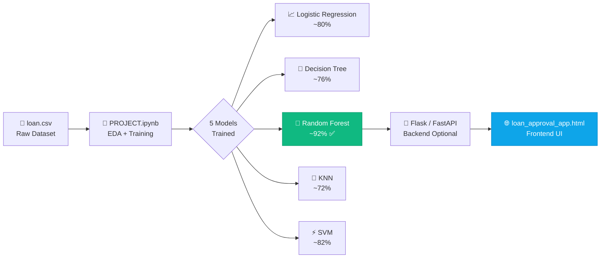
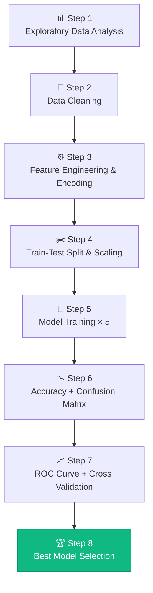

<div align="center">

# 🏦 LoanIQ — Loan Approval Predictor

*A machine learning project that predicts loan approval outcomes using 5 classification algorithms, paired with an interactive web interface.*

[](https://python.org)
[](https://scikit-learn.org)
[](https://jupyter.org)
[](https://developer.mozilla.org/en-US/docs/Web/HTML)
[](#)

---

| 📓 Notebook | 🌐 Web App | 🌲 Best Model | 📊 Models Trained |
|:-----------:|:-----------:|:-------------:|:-----------------:|
| `PROJECT.ipynb` | `loan_approval_app.html` | Random Forest | 5 Algorithms |

</div>

---

## 📁 Project Structure

```
LoanIQ/
├── 📓 PROJECT.ipynb            # Full ML pipeline — EDA, training, evaluation
├── 🌐 loan_approval_app.html   # Standalone frontend web application
└── 📄 loan.csv                 # Dataset (update path in notebook)
```

---

## 🔄 Architecture



---

## 🧪 ML Pipeline — `PROJECT.ipynb`



### Step-by-Step Breakdown

<details>
<summary><b>📊 Step 1 — Exploratory Data Analysis</b></summary>

- Dataset overview: shape, dtypes, null counts, descriptive stats
- **Target distribution** — slight class imbalance; majority loans approved
- **Credit History vs Loan Status** — applicants with `Credit_History = 1` mostly approved
- **Applicant Income Distribution** — right-skewed histogram
- **Correlation Heatmap** — generated before encoding on numeric columns

</details>

<details>
<summary><b>🧹 Step 2 — Data Cleaning</b></summary>

| Column | Type | Strategy |
|--------|------|----------|
| Gender, Married, Dependents, Self_Employed | Categorical | Filled with **Mode** |
| LoanAmount | Numerical | Filled with **Median** |
| Loan_Amount_Term, Credit_History | Mixed | Filled with **Mode** |

Zero missing values remain after cleaning.

</details>

<details>
<summary><b>⚙️ Step 3 — Feature Engineering & Encoding</b></summary>

```python
# New feature: combined income
df['Total_Income'] = df['ApplicantIncome'] + df['CoapplicantIncome']
df.drop(['ApplicantIncome', 'CoapplicantIncome'], axis=1, inplace=True)

# Label encode all categorical columns
from sklearn.preprocessing import LabelEncoder
le = LabelEncoder()
for col in df.select_dtypes(include='object').columns:
    df[col] = le.fit_transform(df[col])
```

</details>

<details>
<summary><b>✂️ Step 4 — Train-Test Split & Scaling</b></summary>

```python
from sklearn.model_selection import train_test_split
from sklearn.preprocessing import StandardScaler

# Stratified 80/20 split
X_train, X_test, y_train, y_test = train_test_split(
    X, y, test_size=0.2, stratify=y
)

# Scale AFTER split to prevent data leakage
sc = StandardScaler()
X_train = sc.fit_transform(X_train)
X_test  = sc.transform(X_test)
```

</details>

<details>
<summary><b>🤖 Step 5 — Model Training</b></summary>

All five models managed via a dictionary loop for clean, DRY code:

```python
models = {
    "Logistic Regression" : LogisticRegression(max_iter=5000),
    "Decision Tree"       : DecisionTreeClassifier(),
    "Random Forest"       : RandomForestClassifier(),
    "KNN"                 : KNeighborsClassifier(),
    "SVM"                 : SVC(probability=True)
}
```

> **Note:** `max_iter=5000` was required for Logistic Regression to converge on this dataset.

</details>

<details>
<summary><b>📉 Step 6 — Evaluation (Accuracy + Confusion Matrix + ROC)</b></summary>

Each model evaluated with:
- `accuracy_score` — overall correctness
- `confusion_matrix` — TP / TN / FP / FN breakdown
- `roc_curve` + `roc_auc_score` — all 5 models plotted on a single ROC graph

</details>

<details>
<summary><b>📈 Step 7 — Cross Validation</b></summary>

```python
from sklearn.model_selection import cross_val_score

for name, model in models.items():
    cv_score = cross_val_score(model, X_scaled, y, cv=5).mean()
    print(f"{name}: {cv_score:.4f}")
```

5-fold CV on scaled data eliminates single-split bias and gives robust performance estimates.

</details>

<details>
<summary><b>🏆 Step 8 — Best Model Selection</b></summary>

| Model | Accuracy | Cross-Val | ROC-AUC |
|-------|----------|-----------|---------|
| Logistic Regression | ~80% | Good | Good |
| Decision Tree | ~76% | Moderate | Moderate |
| **Random Forest** ✅ | **~92%** | **Best** | **Best** |
| KNN | ~72% | Moderate | Moderate |
| SVM | ~82% | Good | Good |

**🌲 Random Forest Classifier** selected as the final production model.

</details>

---

## 🌐 Web App — `loan_approval_app.html`

A fully self-contained, single-file frontend — no server or framework needed.

### ✨ Features

| Feature | Description |
|---------|-------------|
| 🎨 Dark UI | Glassmorphism design with animated grid and ambient glows |
| ⚡ Zero Dependencies | Pure HTML/CSS/JS — open directly in any browser |
| 🔮 Instant Predictions | Visual approval/rejection result on form submit |
| 📱 Responsive | Works across desktop and mobile |

### 📋 Input Fields

```
Personal     →  Gender · Married · Dependents · Education · Self-Employed
Financial    →  Applicant Income · Co-applicant Income
Loan Details →  Loan Amount · Loan Term (months)
Credit       →  Credit History (0 = Bad, 1 = Good) · Property Area
```

### ▶️ How to Run

```bash
# Just open it — no install needed
open loan_approval_app.html        # macOS
start loan_approval_app.html       # Windows
xdg-open loan_approval_app.html    # Linux
```

> To use real ML predictions, connect to a Flask/FastAPI backend serving the saved Random Forest model.

---

## ⚙️ Setup & Installation

### 1. Clone the repository

```bash
git clone https://github.com/your-username/loaniq.git
cd loaniq
```

### 2. Install dependencies

```bash
pip install pandas numpy matplotlib seaborn scikit-learn jupyter
```

### 3. Update dataset path

```python
# In PROJECT.ipynb — first cell
df = pd.read_csv("path/to/loan.csv")
```

### 4. Run the notebook

```bash
jupyter notebook PROJECT.ipynb
```

### 5. Open the web app

```bash
open loan_approval_app.html
```

---

## 🗂️ Dataset — `loan.csv`

| Feature | Description |
|---------|-------------|
| `Loan_ID` | Unique loan identifier |
| `Gender` | Male / Female |
| `Married` | Yes / No |
| `Dependents` | 0 / 1 / 2 / 3+ |
| `Education` | Graduate / Not Graduate |
| `Self_Employed` | Yes / No |
| `ApplicantIncome` | Monthly income of applicant |
| `CoapplicantIncome` | Monthly income of co-applicant |
| `LoanAmount` | Loan amount (in thousands) |
| `Loan_Amount_Term` | Loan term in months |
| `Credit_History` | 1 = Good, 0 = Bad |
| `Property_Area` | Urban / Semi-Urban / Rural |
| `Loan_Status` | **Target** — Y (Approved) / N (Rejected) |

---

## 🛠️ Tech Stack

| Layer | Technology |
|-------|-----------|
| Language | Python 3.7+ |
| Data | pandas, numpy |
| Visualization | matplotlib, seaborn |
| Machine Learning | scikit-learn |
| Notebook | Jupyter |
| Frontend | HTML5, CSS3, Vanilla JS |

---

<div align="center">

Made with 🤖 + ☕ &nbsp;|&nbsp; Random Forest wins every time 🌲

</div>
